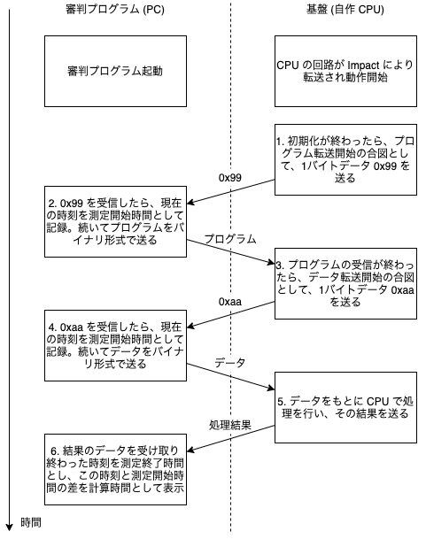

# CPU 実験審判プログラム

## 1. 全体の流れ



## 2.使い方

1. 必要なパッケージのインストール

    ```bash
    $ pip install -r requirements.txt
    ```

2. USB ポートの探索

    - `Windows`: デバイスマネージャーを開いて UART と繋がっているポートを探す (`COM{1,2,3,4}` など)
    - `Ubuntu`: `$ ls /dev/tty*` などで探す (`/dev/ttyUSB0` など)
    - `Mac`: `$ ls /dev/tty.*` などで探す (`/dev/tty.usbserial*`、`tty.SLAB_USBtoUART` など)
        - 見つからない場合には[こちらのページ](http://blueeyes.sakura.ne.jp/2021/06/17/4045/) などを参考にドライバを入れると見つかるはずです
        - 入れるドライバは [FTDI](https://ftdichip.com/drivers/vcp-drivers/) や [Silicon Labs CP2105GM](https://jp.silabs.com/developers/usb-to-uart-bridge-vcp-drivers) などからボード側のポートに合わせて適切なものを選んでください (`Nexys A7` なら `FTDI`、`KCU 105` なら `Silicon Lab` のはず)

3. コマンドの実行

    ```bash
    $ python server.py <port>
    ```

    オプションについては次の章を参照

## 3. オプション

| オプション          | <nobr>略称</nobr> | <nobr>デフォルト値</nobr>  | 説明 |
| :-----------------| :--- | :---------- | :--- |
| `port`            |      |             | UART の繋がっているポートのフルネームを指定。(Windows: `COM3`、 Ubuntu: `/dev/ttyUSB*`、 Mac: `/dev/tty.usbserial*` など) |
| `--program`       | `-p` | None        | CPU で実行するプログラムのバイナリファイルを指定。指定しない場合は "1. 全体の流れ" の手順 1 と 2 は省略。 |
| `--data`          | `-d` | contest.sld | CPU に送るデータのファイルを指定。`.sld` は SLD データとして、`.txt` は空白改行区切りの単精度浮動小数点型データとして、残りはバイナリとして読み込む。 |
| `--output`        | `-o` | output      | 受け取ったデータを保存する際の名前を指定。`--raw_output` が指定されない時は PPM 画像を受け取ると解釈して、`.txt`、`.ppm`、`.png` ファイルを生成する。指定された時はバイナリファイルを生成する。 |
| `--raw_output`    |      | None        | 受け取るバイト数を自然数で指定。 |
| <nobr>`--one_byte_each`</nobr> |  | False | 1 バイトずつ読み込んで PPM をパース。コメントアウトや余分な余白などを含む PPM をパースできるが、**`baudrate` が大きい場合に受信バッファがオーバーフローしてビットをロストする可能性がある**ことに注意。コメントアウトや余分な空白を出力しないようにして、このオプションを外すことを推奨。 |
| `--max_n_bytes`   |      | 1024        | 何バイトずつ読み込むかを指定。 |
| `--baudrate`      |      | 115200      | ボーレートを自然数で指定。 |
| `--endian`        | `-e` | little      | 'little' か 'big' を指定。 |
| `--parity`        |      | none        | 'none'、'odd'、'even'、'mark'、'space' のいずれかを指定。 |
| `--stopbits`      |      | 1           | '1'、'1.5'、'2' のいずれかを指定。 |
| `--no_progress`   |      | False       | パケットを受け取るときのプログレスバーを表示するか指定。 |

`--parity` と `--stopbits` に関しては pySerial の [serial.Serial](https://pyserial.readthedocs.io/en/latest/pyserial_api.html) に準拠。


## 4. 各データのフォーマット

シリアル通信をするとき各データは以下のような形で送られる。

### プログラム

- 読み取ったバイナリの前に、その読み取ったバイナリのバイト数を付加して送る
- バイト数は、int として解釈し、エンディアンに従って、4バイトでエンコードされる

### SLD ファイル

- int、float 両方のデータが存在するが、共にエンディアンに従って、4バイトでエンコードして送る
- データ間の空白などはなし
- 何バイト受け取るかはプログラムが判断するので、送るバイト数は付加しない

### テキストファイル

- 全て float と解釈して読み取って、エンディアンに従って、4バイトでエンコードして送る
- データ間の空白などはなし
- 何バイト受け取るかはプログラムが判断するので、送るバイト数は付加しない

### バイナリファイル

- 読み取ったバイナリをそのまま送る
- 何バイト受け取るかはプログラムが判断するので、送るバイト数は付加しない

### PPM 画像

- P3 (text 形式) か P6 (binary 形式) のいずれかのフォーマットを認識して受け取る
- デフォルトは P3 で、わざわざ P6 に変える必要はあまりないと思われる
- 後ろに余計なデータが付いていた場合は無視される
- `25` を P3 では `\x30\x32\x35` (= `025`) のように一文字ずつバイナリに変換して送るが、P6 では `\x19` のように RGB 値を1バイトで表現して送る
- **`--one_byte_each` をつけない時の仕様**
    - コメントアウトや余分な空白が来ないことを期待している
    - PPM の仕様としては `25`、`025`、`s25` (`s` は半角スペースを表す) のどの形式でも解釈できるが、文字数を合わせるように `025`、`s25` のどちらかの形式を期待している
- 詳しく知りたい方はググってください (~~知らなくても大丈夫~~)

### 注意

- `output.*` や `raytrace` は実験のために使ったサンプルなので、結果がこれと全く同じになるとは限りません

## 5. ChangeLog

- v1.0 (2021/10/02)
    - C 言語で書かれた過去のサーバを Python に移植
    - Windows 以外に Ubuntu、Mac でも動作することを確認
- v1.1 (2021/12/26)
    - v1.0 では 1 バイトずつ読み込んでいたものを 1024 バイトずつ読み込むように修正し、受信バッファのオーバーフローを回避
    - コメントアウトや余分な余白などを含む PPM はパースできない状態に変更
    - `--one_byte_each` オプションをつけることで v1.0 の動作も再現
- v1.2 (2022/01/09)
    - 1024 バイトずつ読み込むときに余分に for ループが回るバグを修正
- v1.3 (2022/02/14)
    - 何バイトずつ読み込むかを指定できるオプション `--max_n_bytes` を追加
    - `--one_byte_each` をつけない時に 0 埋めだけでなく、スペース埋めで 3 桁に揃える形式もサポート
- v1.4 (2022/03/03)
    - `tqdm` のバグを修正
